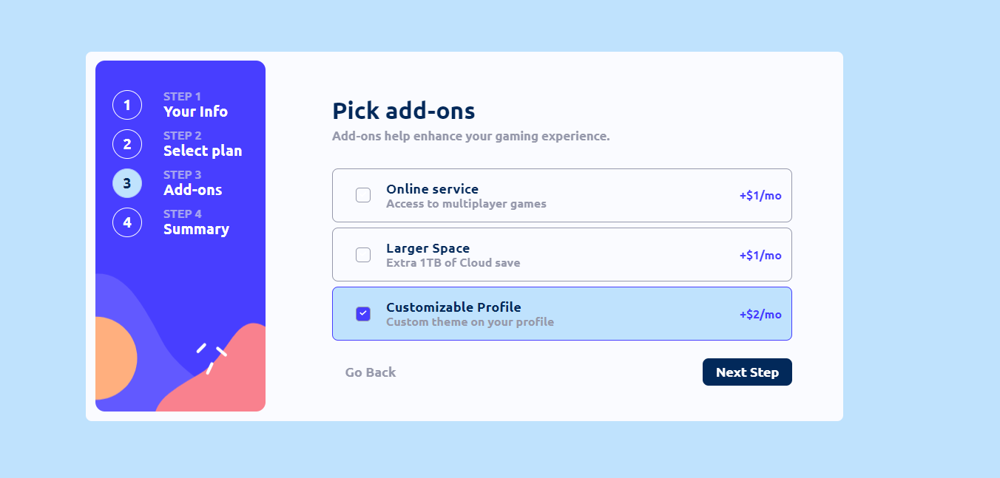

# Frontend Mentor - Multi-step form solution
Took a break from developing my netflix clone and decided to have
 a crack at this advanced project from front-end mentor.

## Table of contents

- [Overview](#overview)
  - [The challenge](#the-challenge)
  - [Screenshot](#screenshot)
  - [Links](#links)
- [My process](#my-process)
  - [Built with](#built-with)
  - [What I learned](#what-i-learned)
  - [Continued development](#continued-development)
- [Author](#author)
- [Acknowledgments](#acknowledgments)

## Overview

### The challenge

Users should be able to:

- Complete each step of the sequence
- Go back to a previous step to update their selections
- See a summary of their selections on the final step and confirm their order
- View the optimal layout for the interface depending on their device's screen size
- See hover and focus states for all interactive elements on the page
- Receive form validation messages if:
  - A field has been missed
  - The email address is not formatted correctly
  - A step is submitted, but no selection has been made

### Screenshot
#### Info Section


#### Plans Section


#### Addons Section


#### Summary Section


#### Thank You  Section


### Links

- Live Site : [Live Site](https://your-live-site-url.com)

## My process

### Built with

- React
- Framer Motion
- Javascript
- BEM Naming convention
- CSS 
- Flexbox
- Mobile-first workflow (cap)


### What I learned

**Never Use Vanilla Javascript for a Project**
 
 like seriously the amount of 

 ```js 
 undefined, null ,NaN
 ``` 
 I had in this project was crazy,
   I also had to cope without intellisense, pain.
So basically from now on Typescript all the way.

```html
<h1>Some HTML code I'm proud of</h1>
```
```css
.proud-of-this-css {
  color: papayawhip;
}
```
```js
'Vanilla Javascript' === 'Pain' //returns  True
```


### Continued development

Build more React js based projects


## Author

- Github - [Nathan_Somto](https://www.github.com/nathan_somto)


## Acknowledgments

The Mozilla docs helped alot.
